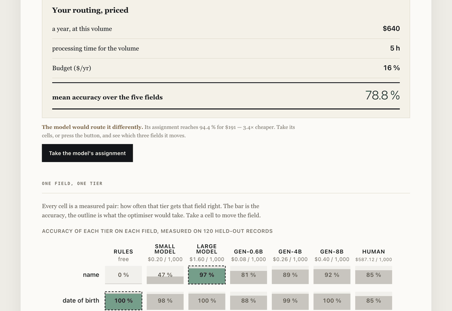

# Where should the next dollar go?

Four tiers — rules, a small model, a large one, a human — measured on held-out data, then
routed under a budget. The answer is rarely "buy the bigger model", and this says why.

<!-- figures:finding -->
**The finding.** Routing every field to the same tier is the default and it is wrong. Measured per field, 3 of the 5 fields are carried by regexes at **zero cost and up to 100 % accuracy**, and the money is worth spending on exactly the ones that need it. Total: **94.4 % for $191** of a $4,000 budget — the budget does not bind. No available budget buys a better routing. Measured on 1000 and 120 held-out cases depending on the tier — the tables carry each figure's own `n`.
<!-- /figures:finding -->

**[Try it in your browser →](https://arslanesempai-ui.github.io/cascade-routing/)** — take a
cell to send a field to another tier and read what your routing costs. No model is called:
the accuracy of each tier was measured once on held-out records and frozen, and the page
replays the arithmetic on those measurements. Measuring them yourself is `npm run measure`,
about two minutes.



<!-- figures:commandes -->
| Command | What it does, in the order that makes sense |
|---|---|
| `npm run test` | types, figures and the suite — start here, it needs nothing downloaded |
| `npm run measure` | measure the encoder tiers and freeze the profile (1.26 GB on the first run) |
| `npm run optimise` | the routing, and what the next improvement would cost |
| `npm run failures` | every case it gets wrong, with its input and its output |
| `npm run sensitivity` | which assumptions decide the answer, and which do not |
| `npm run prompt` | what rewording the prompt moves, against what changing tier moves |
| `npm run regler` | pick each generative tier's formulation on the dev split, never on held-out |
| `npm run apparier` | does the tier ranking depend on the prompt? McNemar on the same cases |
| `npm run departager` | is each tuned formulation separable from its runner-up? refutes, never confirms |
| `npm run tentatives` | query stored per-attempt outcomes — paired tests and clean rates, no GPU |
| `npm run dur` | measure the hard corpus: broken documents, non-Latin scripts, ambiguous readings |
| `npm run mur` | how far the exhaustive solver goes, in fields and tiers, measured |
| `npm run signal` | which key-free signals predict a wrong value, against a random control |
| `npm run escalade` | does a guided cascade beat a fixed tier at the same budget? |
| `npm run abstention` | silence instead of a doubtful value: wrong ones removed per correct one lost |
| `npm run figures` | regenerate every table on this page from the frozen profile |
| `npm run landing` | regenerate landing.json — the figures a published page reads, with their provenance |
| `npm run dossier` | the validation file a reviewer signs |
| `npm run start` | the screen, on localhost:4670 |
| `npm run measure:yours` | your own cases, from a CSV — nothing leaves your machine |
| `npm run benchmark` | the same measurement on a public labelled dataset |
| `npm run intake` | turn a filled-in questionnaire into the assumptions a run uses |
| `npm run egress` | watch the network while a measurement runs, and record what it sees |
| `npm run fuite` | what the prompt owes to the half it was tuned against (needs Ollama) |
| `npm run pages` | build docs/ and verify the published screen — required before publishing: docs/ carries a compiled copy of the code and goes stale silently |
| `npm run captures` | re-record the images on this page |
<!-- /figures:commandes -->

```bash
npm test           # types, README figures, landing.json, and the suite
```

<!-- figures:tests -->
**112 tests** across 8 files, counted from the sources rather than typed here.
<!-- /figures:tests -->

```

Everything runs locally. No API key, nothing leaves the machine, and anyone who clones this
reproduces the numbers below.

**What it actually costs you to reproduce it:** about 400 MB of npm packages, then **1.26 GB
of model weights** on the first `npm run measure` — 474 MB for roberta-base-squad2, 448 MB for
multilingual-e5-small, 249 MB for distilbert, 86 MB for MiniLM. On a 50 Mbit line that is
three and a half minutes of download before anything is measured, and the encoder measurement
itself takes a few minutes more. The generative ladder is a further eight gigabytes and is
optional for exactly that reason.

---

## The first measurement was worthless, and that is the point

The rules scored **100 % on all five fields**. Not a result — I had written the templates,
then written the regexes against those templates. I was marking my own homework, which is
the exact error I had forbidden in writing two projects earlier.

The corpus is now split: the rules were developed on one set of phrasings and are measured
on another they never saw. Measured honestly, they collapse.

<!-- figures:extraction -->
| Tier | name | birth | document | country | address | Latency |
|---|---|---|---|---|---|---|
| `rules` | 0.0 % | 100.0 % | 79.7 % | 100.0 % | 0.0 % | 0.0 ms |
| `small` | 46.6 % | 97.9 % | 57.7 % | 100.0 % | 43.0 % | 19.1 ms |
| `large` | 96.6 % | 100.0 % | 64.4 % | 100.0 % | 32.8 % | 45.2 ms |
| `gen-0.6b` | 80.8 % | 87.5 % | 70.0 % | 83.3 % | 75.0 % | 233.4 ms |
| `gen-4b` | 89.2 % | 99.2 % | 79.2 % | 100.0 % | 95.8 % | 788.0 ms |
| `gen-8b` | 91.7 % | 100.0 % | 83.3 % | 100.0 % | 82.5 % | 1194.5 ms |
<!-- /figures:extraction -->

Two things fall out of that table, and neither is guessable:

<!-- figures:deuxfaits -->
On the address, **the large model is worse than the small one** — 32.8 % against 43.0 % — while costing several times as much. And on the identity number, **the free regex beats 4 of the 5 model tiers**: 79.7 % against 57.7 %, 64.4 %, 70.0 %, 79.2 %, for nothing.
<!-- /figures:deuxfaits -->

The second chain, classifying alert narratives, is where the keyword collapse is starkest:

<!-- figures:classification -->
| Tier | Accuracy | 95 % interval | Latency |
|---|---|---|---|
| `rules` | 21.3 % | [19–24] | 0.00 ms |
| `small` | 69.2 % | [66–72] | 3.89 ms |
| `large` | 40.5 % | [37–44] | 8.73 ms |
| `gen-0.6b` | 61.7 % | [53–70] | 228.27 ms |
| `gen-4b` | 94.2 % | [88–97] | 724.05 ms |
| `gen-8b` | 100.0 % | [97–100] | 998.27 ms |
<!-- /figures:classification -->

Those keywords scored **100 %** against the templates they were written from. On
narratives phrased by someone else, three quarters of that performance was never there.

---

## The second ladder: real generative models

The fair objection to everything above is that these are encoder models — an extractive
question-answering head and a pair of embedding models — and that measuring them says nothing
about routing between generative ones. So the same corpus, the same held-out split and the
same scorer were run against a local Qwen3 ladder at 0.6B, 4B and 8B parameters.

<!-- figures:echelles -->
| Field | `rules` | `small` | `large` | `gen-0.6b` | `gen-4b` | `gen-8b` | Best |
|---|---|---|---|---|---|---|---|
| `name` | 0.0 % | 46.6 % | **96.6 %** | 80.8 % | 89.2 % | 91.7 % | `large` |
| `birth` | **100.0 %** | 97.9 % | 100.0 % | 87.5 % | 99.2 % | 100.0 % | `rules` |
| `document` | 79.7 % | 57.7 % | 64.4 % | 70.0 % | 79.2 % | **83.3 %** | `gen-8b` |
| `country` | **100.0 %** | 100.0 % | 100.0 % | 83.3 % | 100.0 % | 100.0 % | `rules` |
| `address` | 0.0 % | 43.0 % | 32.8 % | 75.0 % | **95.8 %** | 82.5 % | `gen-4b` |
<!-- /figures:echelles -->

**No family wins everywhere, and that is the entire finding.** A specialised extractive head
keeps one field, free regexes keep three, and a generative model takes the one nothing else
could read. The best assignment crosses all three families at once — which is precisely what
routing per document prevents you from discovering.

The ladders also disagree with themselves. On one chain a bigger generative model is worse
than a smaller one; on the other the same three models rank strictly by size. Same models,
same machine, same run, opposite verdicts depending on the task.

**It stays optional.** The encoder ladder is what `npm run measure` measures: a few tens of
megabytes, no server, and anyone who clones this reproduces those numbers in two minutes with
no API key. The generative ladder needs Ollama running and about eight gigabytes of models,
so it lives behind `npm run measure -- --llm`, and a run without the flag leaves its frozen
figures untouched rather than deleting them.

## The prompt was tuned on the test set, and that is my mistake

The generative tiers do not work at all without a worked example in the prompt: without one
the model answers with the field's own name, or with the whole document, and scores zero. The
example that fixed it was arrived at by running the measurement on the **held-out** half,
reading 0 %, changing the prompt, and running it again on the same half.

That is precisely the leak the split exists to prevent — the same error as writing regexes
against your own templates, which this repository already made once and documents above. It
was made again two months later, on a different object, by the person who had written the
defence.

**Two things follow, and both are in the code rather than in this paragraph.** The corpus now
has three halves, not two: `training` for writing rules, `dev` for tuning prompts, `heldout`
read once and deciding nothing but the published figure. A test fails if any two of them share
a phrasing.

And the size of the leak is measured rather than apologised for:

<!-- figures:fuite -->
Not measured yet — run `npm run fuite`. Until it is, the generative figures on this page carry a prompt tuned against the half they are scored on, and are optimistic by an unknown amount.
<!-- /figures:fuite -->

The number that matters is the gap. A prompt that transfers to phrasings it was never tuned
against costs little; one that does not was fitted to the test set, and the published accuracy
was borrowed rather than earned.

## What this sample cannot tell apart

A table of percentages invites the reader to rank them, and on a hundred and twenty cases a
good many of those rankings are noise. These pairs are **not distinguishable** here:

<!-- figures:egalites -->
| Field | Tier | Rate | Tier | Rate |
|---|---|---|---|---|
| `name` | `large` | 96.6 % [95–98], n=1000 | `gen-8b` | 91.7 % [85–95], n=120 |
| `name` | `gen-0.6b` | 80.8 % [73–87], n=120 | `gen-4b` | 89.2 % [82–94], n=120 |
| `name` | `gen-0.6b` | 80.8 % [73–87], n=120 | `gen-8b` | 91.7 % [85–95], n=120 |
| `name` | `gen-4b` | 89.2 % [82–94], n=120 | `gen-8b` | 91.7 % [85–95], n=120 |
| `birth` | `rules` | 100.0 % [100–100], n=1000 | `gen-4b` | 99.2 % [95–100], n=120 |
| `birth` | `small` | 97.9 % [97–99], n=1000 | `gen-4b` | 99.2 % [95–100], n=120 |
| `birth` | `small` | 97.9 % [97–99], n=1000 | `gen-8b` | 100.0 % [97–100], n=120 |
| `birth` | `large` | 100.0 % [100–100], n=1000 | `gen-4b` | 99.2 % [95–100], n=120 |
<!-- /figures:egalites -->

This section exists because it caught me. An earlier headline for this project claimed the
large model was worse than the small one on the address field. It is — by 4.2 points, with
intervals that overlap almost completely. The direction was right and the claim was not
supported, and I would have published it.

The optimiser now applies the same rule rather than merely reporting it: **where two tiers
cannot be told apart, it takes the cheaper one.** A difference inside the interval is not a
difference worth paying for, and it is the first thing anyone validating a model change will
ask about.

## The budget in seconds

Latency used to be recorded and play no part in the routing, which meant the optimiser would
happily send a real-time field to the slowest tier available. On the encoder ladder that was
nearly harmless — five fields summed to about fifty milliseconds. A generative tier costs
around a second per field, so the constraint stops being decorative.

<!-- figures:latence -->
| Ceiling per document | Accuracy | Cost | Actual | Routing |
|---|---|---|---|---|
| 2000 ms | 94.4 % | $191 | 967.7 ms | `large` `rules` `rules` `rules` `gen-4b` |
| 500 ms | 90.3 % | $168 | 290.3 ms | `large` `rules` `rules` `rules` `gen-0.6b` |
| 100 ms | 83.9 % | $180 | 69.7 ms | `large` `rules` `rules` `rules` `small` |
| 50 ms | 75.3 % | $160 | 48.0 ms | `large` `rules` `rules` `rules` `rules` |
| 30 ms | 65.3 % | $20 | 18.0 ms | `small` `rules` `rules` `rules` `rules` |

**What the promise costs.** Lift the ceiling entirely and the cheapest routing that is statistically indistinguishable in accuracy costs $67 instead of $191 — it just takes 2021 ms per document. **Your latency promise is worth $123**, and the money budget never binds at all. That is the shadow price nobody prices.
<!-- /figures:latence -->

Read it as the price list for a service level agreement: each row is what a tighter promise
costs in accuracy. A routing can be affordable and too slow, or fast and unaffordable, and
the two budgets bind independently.

---

## Against doing no work at all

A percentage without its baseline invites the one question you cannot answer. The keyword
classifier scores what it scores — is that bad? It was unanswerable until the trivial baseline was
computed.

<!-- figures:baselines -->
|  | Accuracy | Verdict |
|---|---|---|
| always the most common label | 25.0 % | *answers "fractionnement" every time, ignoring the input entirely* |
| uniform guess | 20.0 % | *picks one of 5 labels at random* |
| `rules` | 21.3 % | **loses to "always the most common label"** by 3.7 points |
| `small` | 69.2 % | beats "always the most common label" by 44.2 points |
| `large` | 40.5 % | beats "always the most common label" by 15.5 points |
| `gen-0.6b` | 61.7 % | beats "always the most common label" by 36.7 points |
| `gen-4b` | 94.2 % | beats "always the most common label" by 69.2 points |
| `gen-8b` | 100.0 % | beats "always the most common label" by 75.0 points |
<!-- /figures:baselines -->

Hand-written keyword rules, refined over an afternoon, carry no information that a
constant does not. That is not a claim I would have made from the accuracy alone, and the
baseline took four minutes to write.

---

## The routing, field by field

<!-- figures:routing -->
| Field | Tier chosen | Accuracy | Cost |
|---|---|---|---|
| name | `large` | 96.6 % | $160 |
| birth | `rules` | 100.0 % | $0 |
| document | `rules` | 79.7 % | $0 |
| country | `rules` | 100.0 % | $0 |
| address | `gen-4b` | 95.8 % | $26 |
| **total** |  | **94.4 %** | **$191** |
<!-- /figures:routing -->

<!-- figures:shadow -->
No budget buys better: the ceiling is in the tiers available.
<!-- /figures:shadow -->

That last sentence is the one worth carrying into a budget meeting. The instinct in the
room is "we need a bigger model" or "we need more budget". The measurement says the money
is not the constraint — no available tier can read an address, and the only thing that
fixes it costs a step, not a slope.

**The two chains want opposite things.** Chain A puts three fields on free rules and needs
the large model exactly once. Chain B finds rules useless and the *small* model better
than the large one. Any advice that does not begin with measuring your own chain is
selling you someone else's.

---

## What it gets wrong

Every tool in this set reported an aggregate accuracy and not one failure. That is the
wrong way round: a percentage is a claim you take on trust, while a named input with the
model's actual output beside the expected one is something you can check.

<!-- figures:gallery -->
552 failures across the machine tiers, grouped by what actually went wrong:

| Failures | Tier · field · what kind of wrong |
|---|---|
| 120 | rules · name · empty |
| 97 | rules · address · empty |
| 72 | large · address · fragment |
| 39 | small · name · wrong span |
| 38 | small · address · wrong span |
| 27 | large · document · over-long |

```
rules · name · empty   [D-0001]
  text      Marcus Ferreira — dob 21 October 1961 — doc no FR-1856-M — Portugal — lives 106 Odos Ermou, Rotterdam (updated by branch
  expected  "Marcus Ferreira"
  got       ""
```

```
rules · document · empty   [D-0008]
  text      re Viktor Vasquez / Italy — address 125 rue Victor Hugo, Lyon — idIT-2390-X — born 17 April 1968 — file opened pending r
  expected  "IT-2390-X"
  got       ""
```

```
rules · address · empty   [D-0001]
  text      Marcus Ferreira — dob 21 October 1961 — doc no FR-1856-M — Portugal — lives 106 Odos Ermou, Rotterdam (updated by branch
  expected  "106 Odos Ermou, Rotterdam"
  got       ""
```

```
small · name · over-long   [D-0002]
  text      KYC REVIEW ⏎ Subject ......... Leila Haddad ⏎ Birth ........... 10/07/1987 ⏎ Document ........ IT-5560-K ⏎ Citizenship .
  expected  "Leila Haddad"
  got       "Leila Haddad Birth........... 10 / 07 / 1987 Document........ IT - 5560 - K Citizenship..... Netherlands Postal"
```

```
small · document · fragment   [D-0002]
  text      KYC REVIEW ⏎ Subject ......... Leila Haddad ⏎ Birth ........... 10/07/1987 ⏎ Document ........ IT-5560-K ⏎ Citizenship .
  expected  "IT-5560-K"
  got       "5560"
```
<!-- /figures:gallery -->

Nothing here is curated for flattery. The gallery takes the first failure of each
tier-and-field pair, in order, and shows what came back.

---

## Measured on somebody else's data

Every other figure on this page comes from a corpus I wrote. That is the fair objection, and
a held-out split does not answer it: it defends against marking your own homework, it does not
turn invented documents into real ones.

So the same measurement — same scorer, same intervals, same trivial baselines — runs on a
public labelled set that somebody else published, with their labels and their oddities.

<!-- figures:public -->
Not run yet — `npm run benchmark`.
<!-- /figures:public -->

The dataset is not vendored here; its address, its checksum and the raw record are, which is
what a stranger needs to get the same numbers or find out why not. `npm run benchmark`
reproduces it.

## What this tool got wrong

Every measurement page shows what the system under test fails at. Almost none shows what the
**measurement** failed at — and that is the only evidence a figure was ever subjected to
anything. A validator can audit a history; they cannot audit a promise.

<!-- figures:retractations -->
| When | What was claimed | What was true | What caught it |
|---|---|---|---|
| 2026-06-14 | The hand-written rules score 100 % on all five fields. | They score 0 % on two of them. The regexes had been written against the very templates used to grade them. | A re-reading, before publication. |
| 2026-07-02 | The small model cannot read an identity number — 0 %, not a low score. | 63 %. The scorer counted « IT - 5560 - K » as a failure against « IT-5560-K »: it was measuring formatting, not content. | The failure gallery, on its first run. |
| 2026-08-19 | The large model is worse than the small one on two fields out of five. | On a single field — and on 120 cases the gap was 4.2 points with intervals that almost entirely overlapped. The claim was not merely miscounted, it was unsupported. | The validation dossier generator, whose « what the sample cannot decide » section listed the pair. |
| 2026-08-19 | On the generative ladder, bigger is worse on one task and better on the other. | The first half holds — 82.5 % against 95.8 % on address, a real gap. The second does not: between 4B and 8B, classification does not move measurably. | The significance test, applied to all four claims at once. |
| 2026-08-19 | 79.7 % — no: « 83 % against 68 % and 63 % » on the document number. | 79.7 % against 64.4 % and 57.7 %. All three figures were right the day they were written and became wrong at the thousand-case re-measurement, inside a sentence nothing regenerated. | A check written that day, which refuses any hand-typed number in the prose. |
| 2026-08-19 | Latency is measured but plays no part in the routing. | True in the morning and false by evening: a budget in seconds now exists and it is the one that binds, not the money. The page contradicted itself from one section to the next. | The audit of the bold claims against the tests that hold them. |
| 2026-08-19 | The overflow defect affects all nine published demos. | One. The other eight carried the same stylesheet and did not overflow: a parent without padding was also required. | Checking the claim, after making it. |
| 2026-08-20 | The published latencies are the models', measured one item at a time on an idle machine. | They were the models' **plus an audio driver nobody had looked at**. `UA Mixer Engine` held one core of ten for sixteen days; stopping it removed 22 to 36 % of every tier's latency, and took the retained chain from 1,341 to 968 ms. The accuracies stayed identical across all 35 tier×field combinations: nothing of the model had changed. | A pass contaminated by my own concurrent work, which made `gen-8b` 32 % slower and made me record machine load for the first time. |
| 2026-08-20 | Everything runs locally. No API key, nothing leaves the machine. | True by default, false on a configuration nothing forbade. A measurement's path contains exactly one outbound call — the generative host — and `OLLAMA_HOST` is an environment variable: pointed at a team server, every document goes to that third party. The promise was conditional and its condition was written nowhere. | The inventory of everything that can open a connection in `src/`, made in order to turn the claim into proof. |
| 2026-08-20 | Twice running, a plausible explanation of the same observation: first that the generative tiers were unstable from pass to pass, then that their latency followed machine load. | Both were wrong. The tiers are deterministic — 35 tier×field combinations identical to the thousandth across four passes. And load does not explain the gap: measured deliberately under a load of 8.35, `gen-0.6b` returns 1,654 ms where the original point claimed 2,098 ms under 7.98. The cause was an audio driver, `UA Mixer Engine`, holding one core of ten for sixteen days; stopping it removed 22 to 36 % of latency from every tier. | An experiment built to reproduce the missing point, which returned the opposite verdict to the one it was meant to confirm. |
| 2026-08-21 | Each generative tier had a formulation chosen for it on the tuning split: `A-sans-exemple` for gen-0.6b and gen-4b, `B-exemple-apparie` for gen-8b. The file wrote them under a key named `retenu` — retained — with no interval and no test. | The selector took the maximum of five rates. The winners beat their runners-up by 12, 1 and 3 field extractions out of 600 — for gen-4b, `A-sans-exemple` at 99.3 % over `C-minimal` at 99.2 %, which is a single extraction. Nothing in the file said so, and nothing could: the script kept only rates, so the margins were not even recoverable from it. A maximum over five noisy numbers is a choice dressed as a measurement. Re-measured paired on 21 August, against the runner-up each tier actually had: none of the three separates. gen-0.6b 37–25, gen-4b 2–1, gen-8b 3–0. Not one of the formulations is retained, and the six rates reproduced to the tenth — so it was never the measurement that was wrong, only the act of reading a ranking out of it. | A paired test run for a different question, whose data made the margins visible; then by checking which formulation was actually the runner-up before drawing anything from it; then by measuring those real pairs, which refuted all three. |
| 2026-08-21 | First, that `B-exemple-apparie` lost accuracy on the birth field because the model reformatted its answer to match the example's date style. Second, that gen-0.6b collapses without an example because a small model needs one to understand the task. | The first was refuted by looking: 52 of 55 failures are corrupted output, not reformatting — `1 August 1955` came back as `1 August 1:55`. The second is contradicted by the same table it was read from: `A-sans-exemple` contains no example and is the best formulation gen-0.6b has, at 83.5 %. | Being told to check the first before building on it, and by reading the column that disproved the second. |
| 2026-08-21 | Nearly: that the per-tier formulations survived a paired test. McNemar separated `A-sans-exemple` from `reference` on gen-4b, 32–1, p = 8e-9, and separated them the other way on gen-8b, 45–1. Two decisive p-values, sitting right next to the question of whether the tuning choice held. | Neither test touches the tuning decision. gen-4b's runner-up was `C-minimal`, not `reference`; gen-8b's winner was `B-exemple-apparie`, which was not in the run at all. The comparison measured was winner against third place, and loser against second. The p-values are correct and answer nothing that was asked. | Reading the runner-up out of the tuning file before writing the sentence, instead of after. |
| 2026-08-21 | Every tier of the published relevé records the commit it was measured at — `64bdacf` — so a reader can check out the exact code that produced the number. landing.json carried it for all seven tiers. | That commit no longer exists. Purging 1.4 MB of raw outputs from eleven commits changed their hashes, and the relevé kept pointing at the old one. A reader following it gets nothing. Recording a commit has exactly one purpose — that someone can go and look — and for a full day the field was dead while looking alive. The content is recoverable: `19d19e8` introduces the load field the relevé carries, its predecessor does not, and the pass began 63 seconds after it with no other commit for the next six hours and forty-eight minutes. That is an argument, not a record, and it is labelled as one. | Trying to emit the formulation per tier, which meant asking git about the measuring commit — and being told it did not exist. |
| 2026-08-21 | Nearly: that accuracy is identical to the thousandth at both loads, across the profile. The first version of the load sweep computed exactly that and returned true. | Six of the seven tiers were never measured under load — they are copied from the rest pass, provenance and all. Their agreement is a copy compared with itself. Exactly one tier, gen-0.6b, was measured at both loads: identical accuracy to the thousandth, 79.333 % both times, and latency moving 222 to 290 ms. That single tier is a real result and the whole of the evidence. The per-document time is also identical at both points, for a reason that has nothing to do with load: the chosen routing does not use gen-0.6b. | Two identical msPerDoc values in the generated output, on a comparison built precisely because latency was expected to move. |
| 2026-08-21 | Nothing yet. The durations of the hard-corpus pass would have been published as measured on an idle machine. | Type-checking and a test file ran while that pass was recording per-attempt durations. Accuracy is unaffected — it does not depend on load — but every `ms` in that run is contaminated. The morning's version of this cost gen-8b 32 % of its latency and produced a page section that had to be retired twice. | Noticing it while it was happening, and saying so before the pass returned. |
| 2026-08-21 | Nearly, and in the worse direction: that two runs of the same pass had produced different outputs on twenty-two fields — that the tiers were not deterministic after all, contradicting a result this repository already holds. | The runs are identical. Accuracy matches to the tenth for all six tiers, and every one of the twenty-two apparent divergences sits on the single case id `M1`, which names a German passport in the malformed file and a four-script United Nations travel document in the non-Latin one. The journal keyed rows on `field|caseId`, so the two collapsed into one and the comparison held a passport against a UN document while believing it held one tier against another. It returned no error. It returned a number, and five of a hundred and sixty-four fields vanished from every paired test without a word. | Checking a surprising result before reporting it, rather than after — the divergences were all on one case id, which is not what a non-determinism looks like. |
| 2026-08-21 | That the hard-corpus re-run's durations were unusable — the footer said so, peak 5.11 on ten cores, 0.51 per core, over the threshold. | Nothing else was running. A generative pass loads the machine by itself, and measuring its durations against its own load condemns all of them. measure.ts separates external load before from total during for exactly this reason; the footer written an hour earlier conflated them. A field that always says no carries no more information than a missing field, and it is worse, because it looks like a verdict. | Its first use on a real pass, which returned false on an idle machine. |
| 2026-08-21 | That the hard-corpus run's durations were usable. The footer said so, and the field's name said it plainly. | Another session downloaded a 1.36 GB model during the last 71 seconds of that pass — established from the blob's own timestamps, created 15:58:51Z and finished 16:01:04Z against a pass ending at 16:00:02Z, not from the report of it. The field said true. Its first version, judging total load during the pass, said false on every pass including idle ones. Neither version was right, because a machine cannot tell its own load from an intruder's, and the name promised exactly that separation. Renamed to what it measures: whether external load before the pass was under the threshold. Nothing in a journal now claims to know whether durations are reusable. | Being told a model had been pulled, and checking the timestamps rather than taking the window on trust. |
| 2026-08-21 | That each recorded duration is an inference time. The latency column says nothing else, and the provenance beside it records the commit, the load and the formulation — but not whether the model was in memory. | Loading smallest-first evicts the small models when the large one arrives, silently: `ollama ps` returns one line fewer, with no error. So the first call to each tier measured a load from disk, not an inference — 1,066 ms against a 213 ms median for gen-0.6b, 2,346 against 679, 3,102 against 1,057. One call per tier out of a hundred and twenty, which is why no median moved and why nothing ever showed it. | A second machine reporting the ordering effect, and then checking it here rather than adopting its numbers — three trials each way on this machine: three, three, then two models resident loading largest-first; one, one, one loading smallest-first. |
| 2026-08-21 | That gen-4b and gen-8b each complete twelve whole documents of forty-four, eleven of them the same — so the two tiers fail on the same documents, the nine-point field gap scatters across fields that never complete a file, and per-document routing would gain one document in forty-four. | Each completes one whole document of thirty, and they share none. gen-4b completes R3, gen-8b completes M3. The count treated a document as whole when every recorded field was correct, on a corpus mixing thirty five-field cases with fourteen ambiguous cases declaring one field each — so any ambiguous case with its single field right counted as a complete document. Twelvefold too large, and the conclusion inverted: the two tiers do not save the same documents, they save disjoint ones. Neither figure supports a rate — one per tier is far below this repository's floor of twenty — so what survives is the ceiling and not a recommendation. | The pass printing 0/30 for four tiers where the earlier query had said 4, 4 and 10 — two numbers from the same data that could not both be right. |
| 2026-08-21 | That the best fixed routing within the cascade's budget completes two whole documents at 0.99 € per thousand, half the recommended routing's price. It was written in the escalation report and appeared in no file. | That routing runs at 3,273 ms per document against a declared ceiling of 2,000. It is not a cheaper routing, it is a forbidden one. The search that produced it constrained cost and never latency — in the same report whose central finding is that escalation to gen-8b fails because it breaks that exact ceiling. The number was also absent from escalade.json, which is the defect this repository has spent the day removing from its own page. | The coordinating session reading the report against the file and finding the routing in neither. |
| 2026-08-21 | That there is no tier-ordering crossover at any input length here — gen-4b faster than gen-8b at all four sizes measured — and that the cost ratio between the smallest and largest tier runs from ×4.1 to ×11.8. | Re-measured with five repetitions and the ranges printed, the spread on a single call swamps the effect being reported: gen-0.6b at 200 input tokens runs 167 to 802 ms, a factor of nearly five. At 902 tokens the medians now put gen-4b marginally slower than gen-8b — 2,385 against 2,308 — with ranges of 1,403–2,898 and 2,272–4,010 that overlap almost entirely. Neither the crossover nor its absence is established at that point. The ratio range moved from ×4.1–×11.8 to ×4.5–×9.7 between the two sweeps, so the first range was noise quoted as a measurement. | The coordinating session reporting that it had run a Chrome render during the pass, which prompted a re-measure to find out whether the numbers were contaminated. They were unstable for a simpler reason: three repetitions. |
| 2026-08-21 | That escalating a single field to gen-8b costs 2,069 ms against a 2,000 ms ceiling and is therefore inadmissible — 'for a single field on any document' — and that escalation buys nothing. | Four of five fields, not five. The recommended routing sends `country` to `rules`, whose latency is nil, so escalating it costs only gen-8b's own time: 1,863 ms, a hundred and thirty-seven under the ceiling. And that one admissible escalation gains twenty-six fields of a hundred and fifty — 44 to 70, paired 0–26, p = 3e-8, Wilson intervals that do not touch — for thirty pence per thousand more. It gains no whole document, because the other four fields keep failing. So escalation buys fields within the budget and does not buy files, which is narrower and truer than what was written. | Emitting the ceiling figure per field because the page asked for it, instead of quoting the single field the earlier measurement happened to use. |
| 2026-08-21 | That forcing the output schema divides the price of `gen-4b` by 8.4, written into a landing.json caveat and a test comment as a settled figure. | Three things weaken it. The durations were twenty calls reported as means with no spread, which is exactly the defect retracted earlier the same evening on the length sweep, on a machine where one call varies by a factor of five. The mean unconstrained length is 200.0 tokens, which is precisely the `num_predict` cap — so every call was clipped and the real length is not measured, only bounded below by a cap I chose; raise the cap and the ratio rises with it. And it was measured on one tier of three. | The coordinating session noticing that a figure larger than anything else found that night had been written in parentheses, and asking whether it was measured or deduced. |

19 of these 25 are now held by a named test, so the same mistake fails the build rather than reaching a reader.
<!-- /figures:retractations -->

Each line names what caught it, because that is the part worth copying. Two were caught by a
person re-reading, and the rest by a check that now runs on every commit — which is the whole
argument for turning a lesson into a test rather than a note.

## Where every number comes from

The separation is the most important thing in this repository, and it used to be a
paragraph I wrote by hand — which is the one form it must not take. A page that classifies
its own figures, typed out, goes stale the first time somebody adds one, and it goes stale
in the flattering direction: the figure you forget to declare is the one you were least
comfortable declaring. It is generated from the code now, and a test fails if anything the
tool runs on is missing from it.

<!-- figures:provenance -->
**4 measured**, **13 assumed**, **6 chosen**. What each kind means, and what you are entitled to ask of it:

- **measured** — running the code in this repository produces it. *run it yourself — the draws are seeded.*
- **assumed** — an input nobody here can know; yours to supply. *put your own figure in, and read the band around it.*
- **chosen** — my judgement and nothing else. *check whether the sweep says it decides anything.*

| Kind | Name | What it is | Note |
|---|---|---|---|
| measured | `profiles` | per-field accuracy and latency for each tier | real models pinned by revision, scored on a held-out split, on the chosen corpus below |
| measured | `routing` | the cheapest assignment of tiers to fields that fits the budget | exhaustive over all 1,024 combinations — no heuristic, nothing to tune |
| measured | `shadowPrice` | the smallest budget increase that actually buys a better routing | a step, not a slope: differentiating a staircase says the next euro buys nothing |
| measured | `REVISIONS` | the exact model revisions the figures were produced with | pinned, so a stranger reproduces the table rather than a different one |
| assumed | `humanAccuracy` | how often a human reviewing their fortieth file of the day gets it right | moved here from being infallible by construction, which made the human tier unbeatable |
| assumed | `humanSeconds` | seconds a human spends on one item | your own handling times |
| assumed | `analystAnnualCost` | loaded annual cost of an analyst | your finance team knows this exactly |
| assumed | `productiveHoursPerDay` | hours genuinely productive per day | never eight; weeks of work to establish |
| assumed | `workingDaysPerYear` | working days in your calendar | your HR calendar knows this exactly |
| assumed | `pricePerThousandSmall` | cost per thousand calls to the small model | your provider's price list, on your traffic |
| assumed | `pricePerThousandLarge` | cost per thousand calls to the large model | same, and it moves faster than any other figure here |
| assumed | `machineHourlyCost` | what an hour of the machine running a local model costs you | a local model has no tariff — it occupies a box, and your infrastructure bill knows what that costs |
| assumed | `volume` | items to process over the period | your scenario, not mine |
| assumed | `budget` | money available over the period | your scenario; it decides which tiers are reachable at all |
| assumed | `latencyBudgetMs` | milliseconds allowed for one whole document, end to end | your service level agreement knows this exactly; it binds independently of the money |
| assumed | `costWrongValue` | what a false value entering the record costs you | your risk function knows this; it is the number a regulator asks about |
| assumed | `costBlankField` | what a blank field costs you | one analyst review — the only one of the two anybody can price from a timesheet |
| chosen | `CHARGE_MAX_PAR_COEUR` | the external load per core above which a duration is not recorded | 0.5 because it felt right, not because anything was weighed — and it decides whether a pass keeps its own timings or the previous ones. It is compared to `externalBefore`, the load the machine carried before the tier started, never to `totalDuring`: an encoder saturates the cores by doing its job, and comparing that would refuse every measurement |
| chosen | `CONFIANCE` | the confidence level every interval and every tie is decided at | 95 % because that is wilson()'s default, not because anyone weighed it — and it decides which findings survive |
| chosen | `corpus` | the synthetic documents the models are scored on, and their ground truth | the first measurement scored rules at 100 % because I wrote the regexes against my own templates |
| chosen | `TRAINING / HELDOUT` | which phrasings the rules may see and which they are scored on | the defence against marking my own homework; a test fails if the two share a shape |
| chosen | `FIELDS` | the 5 fields extracted from each document | a real onboarding form has more, and more of them ambiguous |
| chosen | `TIERS` | the 7 tiers a field may be routed to | more tiers make the routing finer and the optimisation no harder |
<!-- /figures:provenance -->

The load-bearing chosen thing is the corpus. The accuracies above are real measurements —
real models, pinned by revision, scored on a held-out split — taken on documents I wrote.
The split defends against the worst version of that problem, which this repository already
walked into once: the first measurement scored the rules at 100 % because I had written the
regexes against my own templates. A held-out split stops you marking your own homework. It
does not turn an invented corpus into documents a bank would send.

What survives is exact: **the method is the finding, the accuracies are illustration.**
That a cheap model carries some fields and not others, that its ceiling is a property of
the field rather than of the budget, that routing per field beats routing per document —
that holds for any corpus with this structure. That birth dates reach 100 % on the small
model holds for mine.

---

## How it's built

```
src/
  corpus.ts      the two case sets, split into training and held-out halves
  tiers.ts       four tiers per chain: rules, a small model, a large one, a human
  measure.ts     measure once, freeze the profile
  assumptions.ts everything that is not measured, and why it cannot be
  optimise.ts    exhaustive routing under budget, and the price of the next step
  failures.ts    what it gets wrong, classified by what kind of wrong
  interval.ts    Wilson intervals — a rate without its sample size is not a measurement
  figures.ts     these tables, generated from the code rather than typed
```

Node with native TypeScript, no build step. `distilbert-squad` and `roberta-base-squad2`
for extraction, `all-MiniLM-L6-v2` and `multilingual-e5-small` for classification, all
local through `@huggingface/transformers`.

**The routing is exhaustive, not heuristic.** Five fields and four tiers is 1,024
combinations, which is instant — and it guarantees the optimum, which no heuristic does.

**The shadow price measures the step, not the slope.** A first version relaxed the budget
by 10 % and concluded "the next euro buys nothing" — true, and useless. The next gain does
not cost 10 % more; it costs an entire tier.

---

## What it doesn't do

- **No real cost data.** Latency is measured; prices are assumed and editable. Anyone
  quoting you a cost-per-thousand without your traffic profile is quoting someone else's.
- **No streaming, no batching, no caching.** All three change the economics substantially
  and none is modelled here.
- **Synthetic corpora.** Held-out, seeded and reproducible, but written by me. On your
  documents every figure needs re-measuring — which is the first finding of this whole set
  of tools, and the reason the measurement harness ships with it.
- **No human in the loop actually in the loop.** The human tier is a price and an
  assumption, not a queue.

---

Part of a set: [document search that refuses when it doesn't
know](https://github.com/ArslaneSempai-ui/compliance-document-search), [an onboarding
agent that escalates when it isn't
confident](https://github.com/ArslaneSempai-ui/kyc-triage-agent), [a bench that says
whether either still works](https://github.com/ArslaneSempai-ui/regression-bench),
[what a detection threshold costs](https://github.com/ArslaneSempai-ui/alert-triage-economics),
and this — where the next euro should go.

---

## What this does not let you conclude

**Not "small models are good enough."** Small models are good enough *for three of these
five fields*, and hopeless at the fourth. The finding is that the question has to be asked
per field, which is precisely what routing per document prevents you from discovering.

**Not "the accuracy printed above is the accuracy you would get."** It is the accuracy on a corpus I wrote,
with a held-out split that defends against the worst version of that problem and does not
turn invented documents into real ones. The method travels; the number does not.

**Not "the budget does not matter."** It does not bind *here*, at this volume, with these
prices. Multiply the volume by fifty or drop the budget by a hundred and it binds
immediately — which the sensitivity sweep says explicitly rather than reporting the tiers
as insensitive.

**Not "the human tier is not worth it."** The human tier costs more than the entire budget
at this volume, so it is never selected and its quality never enters the calculation. That
is a statement about price, not about people, and the sweep reports it as priced out rather
than as irrelevant.

---

## What I would do differently

**Write the held-out split before the first measurement, not after it.** The first run
scored the rules at 100 % because I had written the regexes against my own templates. It
took a full rebuild of the corpus to fix, and thirty minutes of discipline up front would
have avoided it.

**Check the scorer before believing the scores.** 133 of 685 recorded failures were format
mismatches — `10 / 07 / 1987` against `10/07/1987`. Correcting the comparison moved one
field from 51.7 % to 100 % and retired a claim on this page. A scorer that measures
formatting is worse than no scorer, because it produces confident wrong numbers.

**A measurement you record and never use is a measurement you do not have.** Latency was
recorded from the first version and played no part in the routing for months: the optimiser
would happily send a real-time field to the slowest tier, and nothing said so. It took a
generative tier — a second per field instead of twenty milliseconds — to make the omission
visible. There is a budget in seconds beside the budget in dollars now, and it turns out to
be the one that binds. The lesson is not about latency: it is that a column in a data file
proves nothing until a decision reads it.

---

## What a reviewer can check without running anything

| Claim | Where it is checked |
|---|---|
| Every figure on this page | Generated from the frozen profile; `npm test` fails if the page drifts |
| The models | Pinned by exact revision, so a clone measures the same thing |
| The split | A test fails if training and held-out phrasings share a shape |
| Every assumption | Declared in the inventory and swept, with "priced out" told apart from "irrelevant" |
| The routing | Exhaustive over all 1,024 combinations — no heuristic, nothing tuned |
| Every failure | Published in full, by kind, rather than summarised into a rate |

---

**Arslane Chaouche Ramdane** — six years in AML/KYC and financial crime operations,
moving into AI transformation work.
